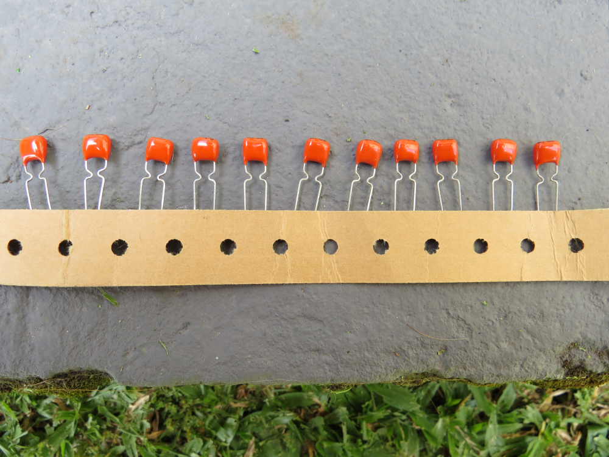
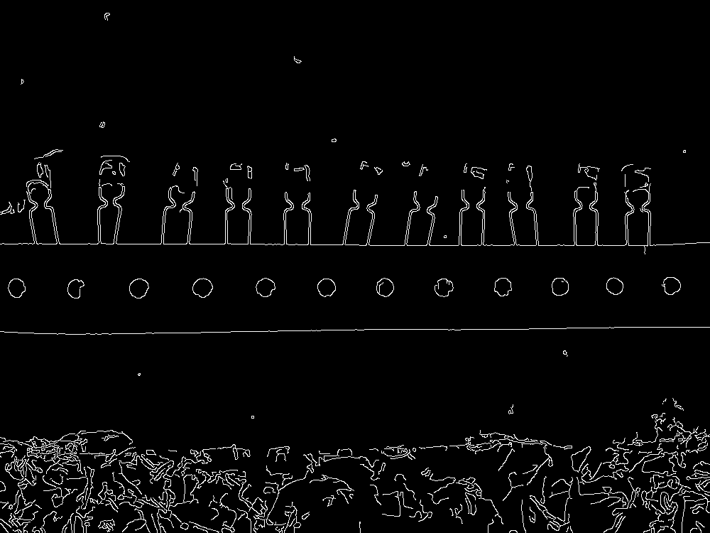
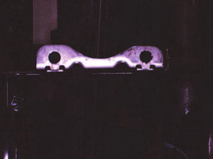
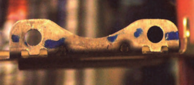

# Hough Bézier Detection

Detects the location and angle of a given Bézier curve in a given image using the Hough transform. The Bézier curve is represented by its control points. The parameter space is translation of control points in `x` and `y` and rotation in radians. The user provides the increment size for each parameter, as well as initial angle and angle displacement (to compute the final angle).

After applying the Hough transform, it uses an algorithm to find the local maxima in the accumulator matrix. Although the detected curves are expected to be in the position in the accumulator matrix that received more votes, finding these positions is not so trivial because of noise. It can be expected that these positions will have a value that is greater than all its neighbors, but this can happen with values that are much lower that what is expected for detections.

So, the algorithm finds all positions that have a higher or equal value than its neighbors, so long as those that are equal are also higher or equal that its neighbors, and discards those with a value lower than a user provided threshold.

The result is the original image, with the detected curves overlayed, and the set of local maxima. The curves are color coded by their rotation, Blue represents the initial angle, going through green towards red, which is the final angle. The local maxima are 3D points where each coordinate represents a parameter. The `x` and `y` coordinates relate to the translation of the curve, starting at the image origin and considering the curve's centroid, multiplied by the increment size. The `z` coordinate relate to the rotation of the curve and equals `(rotationStep * z) + rotationStart`.

For example, consider the following image (downsampled from the original 4000 × 3000):

I want to find where are the capacitors. I will use that characteristic curve in their terminals. First, I applied [Canny](https://en.wikipedia.org/wiki/Canny_edge_detector) to the original image:

Then I extracted the curve I want to find:

Then I used my [Bézier Drawer](https://github.com/GuiRitter/BezierDrawer) to make an initial guess to the curve and my [Bézier Fitter](https://github.com/GuiRitter/BezierFit) to make the template curve match the above image as much as possible. Then I measured the minimum and maximum angle of the capacitor terminals in the image to reduce the parameter space and speed up computations. Then I ran this program with the control points and got this image:

(cropped because I estimate doing it with the whole image will take about 40 minutes, but I'll do it)

Although I tested this program with this capacitors image I shot myself, I wanted to use a dataset in the context of visual inspection / industrial machine vision, but I couldn't find such dataset. If someone knows if such a dataset exists and where, please tell me, I'll be glad to know about it. I'm looking for something like this:

 

Taken from:

[Brandon Miles and Brian Surgenor (2011). Machine Vision for Inspection: A Case Study, Assembly Line -
Theory and Practice, Prof. Waldemar Grzechca (Ed.), ISBN: 978-953-307-995-0, InTech, Available from:
http://www.intechopen.com/books/assembly-line-theory-and-practice/machine-vision-for-inspection-a-casestudy](https://www.intechopen.com/books/assembly-line-theory-and-practice/machine-vision-for-inspection-a-case-study)
